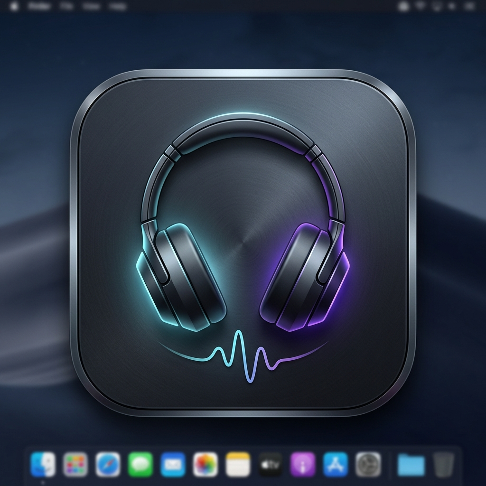

<div align="center">
  
  <h1>Sony Companion App for Windows</h1>
  <p><b>The ultimate desktop companion app for Sony Headphones on Windows 10 & 11 PC</b></p>
  <p>Control Noise Cancelling, Ambient Sound, 5-Band Equalizer, Clear Bass, DSEE & Battery directly from your desktop — no phone required.</p>

  <p>
    <a href="https://isocpp.org/"></a>
    <a href="https://microsoft.com"></a>
    <a href="https://microsoft.com"></a>
    <a href="LICENSE"></a>
    <a href="https://github.com/whitebeard10/SonyCompanionApp/releases"></a>
  </p>
</div>

---

## 🎧 Why Use Sony Companion App on Windows PC?

The official **Sony Headphones Connect** app is only available on mobile (iOS/Android). **Sony Companion App** is the premier open-source desktop client built for Windows PC users who want full control over their Sony Bluetooth headphones without reaching for their phone.

Whether you own the **WH-1000XM5**, **WH-1000XM4**, **WH-CH720N**, **WF-1000XM4**, or **LinkBuds S**, this app provides instant hardware control over your headphones right from your Windows desktop.

---

## ✨ Key Features

- 🎚️ **Noise Cancelling & Ambient Sound Control**
  - Toggle Noise Cancelling, Ambient Sound Mode (Level 0–20), and Off.
  - **Focus on Voice** passthrough mode for clear conversation.

- 🎛️ **5-Band Equalizer & Clear Bass Control**
  - Adjust custom frequency sliders (*400Hz, 1kHz, 2.4kHz, 6.3kHz, 16kHz*) and **Clear Bass** level.
  - Presets: *Bright, Excited, Mellow, Relaxed, Vocal, Treble Boost, Bass Boost, Speech, Manual*.

- ✨ **Sony DSEE Audio Upscaling**
  - Toggle Digital Sound Enhancement Engine (DSEE HX / Ultimate) audio upscaling.

- 🔋 **Real-Time Battery Level Indicator**
  - Per-earbud (Left / Right) and charging case battery ring gauges for TWS earbuds, or main battery gauge for over-ear headphones.

- 🎧 **Smart Headphone Graphics & Auto-Detect**
  - Automatic model recognition with high-resolution Sony headphone product renders.
  - Smart case-insensitive matching for custom Bluetooth names (`WH-CH720N`, `WH-1000XM4`, `LE_WH-1000XM5`, `LinkBuds S`).

- 🧬 **Dual Protocol Support (v1 & v2)**
  - Auto-detects legacy **v1 protocol** (WH-1000XM3, WH-1000XM4) and second-generation **v2 protocol** (WH-CH720N, WH-1000XM5, WF-1000XM5, WF-C700N).

- 🖼️ **Modern Windows 11 Design**
  - Borderless dark glassmorphic UI, Windows 11 DWM rounded corners (`DWMWCP_ROUND`), single-instance process protection, and native taskbar integration.

---

## 📱 Supported Sony Headphones Models

| Series | Supported Models |
| :--- | :--- |
| **WH-1000X Series** | WH-1000XM6, WH-1000XM5, WH-1000XM4, WH-1000XM3, WH-1000XM2 |
| **WF-1000X Series** | WF-1000XM5, WF-1000XM4 |
| **WH-CH / XB Series** | WH-CH720N, WH-CH520, WH-XB910N, WH-XB900N, MDR-XB950BT |
| **WF-C & LinkBuds** | WF-C700N, LinkBuds S |

---

## 🚀 How to Install & Run on Windows

1. **Download**: Download `SonyCompanionApp.exe` from the root directory or [GitHub Releases](https://github.com/whitebeard10/SonyCompanionApp/releases).
2. **Pair Headphones**: Ensure your Sony Bluetooth headphones are paired in Windows Bluetooth Settings.
3. **Launch App**: Double click `SonyCompanionApp.exe`.
4. **Connect**: Select your headphones from the list and click **Connect Device**.

---

## 🛠️ Building from Source

### Prerequisites
- **Windows 10 / 11**
- **Visual Studio 2022** (C++ Desktop Workload)
- **CMake 3.15+**

```powershell
cd Client
mkdir build
cd build
cmake .. -G "Visual Studio 17 2022" -A x64
cmake --build . --config Release
```

---

## ❓ Frequently Asked Questions (FAQ)

### Is there an official Sony Headphones app for Windows?
No, Sony only publishes the *Sony Headphones Connect* app for iOS and Android. **Sony Companion App** is an open-source Windows application created to fill this gap for Windows PC users.

### Can I control Noise Cancelling and Equalizer from my PC?
Yes! Sony Companion App connects directly to your headphones over Bluetooth RFCOMM and sends native Sony protocol commands to switch Noise Cancelling levels, adjust the 5-band EQ, and check battery levels.

### Does this app require internet access?
No. The app operates 100% offline via local Windows Bluetooth APIs (`AF_BTH`).

---

## 📄 License & Disclaimer

- **License**: MIT License — see [LICENSE](LICENSE).
- **Disclaimer**: This project is an independent open-source client and is not affiliated with or endorsed by Sony Corporation.
